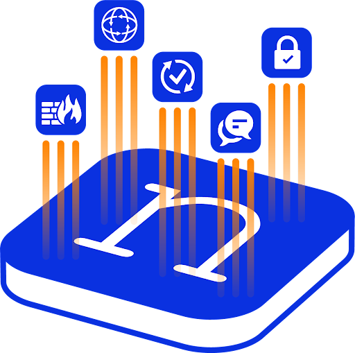

# Device Broker

  
   
  
  
  
  
   
  An <a href="https://networktocode.com/nautobot-apps/">App</a> for <a href="https://nautobot.com/">Nautobot</a>.

## Overview

The Device Broker app is a powerful network automation tool that enables execution of commands on network devices directly from within Nautobot. Built as a platform-agnostic solution, it provides a unified interface for interacting with diverse network equipment regardless of vendor or platform, eliminating the need for network operators to manage separate tools or scripts for device interaction.

Key features include:

- **Multi-device command execution**: Execute commands across multiple devices simultaneously with a single job
- **Dynamic platform support**: Supports any network device platform supported by Netmiko through runtime configuration - no code changes required
- **Intelligent device selection**: Target devices through individual selection, platform filtering, location filtering, or combinations
- **Seamless secrets integration**: Automatically integrates with Nautobot's secrets groups for secure authentication management
- **Configuration mode support**: Execute both operational and configuration commands with automatic mode switching
- **Comprehensive logging**: Detailed per-device logging of all interactions, commands, and results with complete audit trails
- **Robust error handling**: Advanced error handling with detailed reporting for connection failures and command errors
- **No maintenance overhead**: Platform support added through Nautobot configuration without requiring app updates or restarts

The app bridges the gap between Nautobot's device inventory and actual device interaction, making it an essential tool for network troubleshooting, bulk configuration changes, compliance auditing, and network automation workflows where consistent command execution across multiple devices is required.

## Screenshots

The Device Broker app provides an intuitive interface through Nautobot's job system for network device command execution. The primary interface is accessible through the Device Broker Job, featuring:

**Device Selection Options:**
- Individual device selection from multi-select dropdown lists
- Platform-based filtering to target all devices of a specific platform type
- Location-based filtering for site, region, or rack-level operations
- Combination filtering with automatic deduplication for precise device targeting

**Command Execution Features:**
- Multi-line command input supporting complex command sequences
- Configuration mode toggle for operational vs. configuration commands
- Real-time job progress monitoring with per-device status updates
- Detailed per-device result logging with command output and comprehensive error reporting

**Key Benefits:**
- Unified interface eliminating the need for multiple vendor-specific tools
- Zero-maintenance platform support through Nautobot's platform configuration system
- Secure credential handling through Nautobot's built-in secrets management
- Comprehensive audit trail of all device interactions for compliance and troubleshooting
- Scalable execution across large device inventories with intelligent error handling

More detailed screenshots and usage examples can be found in the [Using the App](user/app_use_cases.md) section.

## Documentation

Complete documentation for the Device Broker app includes:

- **[User Guide](user/app_overview.md)** - App overview, getting started, and usage patterns
- **[Administrator Guide](admin/install.md)** - Installation, configuration, and maintenance
- **[Developer Guide](dev/contributing.md)** - Extending functionality and contribution guidelines
- **[Release Notes](admin/release_notes/index.md)** - Version history and changelog
- **[FAQ](user/faq.md)** - Frequently asked questions and troubleshooting

### Contributing to the Documentation

Documentation source files are located in the [`docs`](https://github.com/jtdub/nautobot-app-device-broker/tree/develop/docs) directory. The documentation is built using [MkDocs](https://www.mkdocs.org/) and can be viewed locally using the development environment.

## Questions

For questions or support:

1. Check the [FAQ](user/faq.md) for common issues and solutions
2. Join the [Network to Code Slack](https://networktocode.slack.com/) in the `#nautobot` channel
3. Create an issue in the [GitHub repository](https://github.com/jtdub/nautobot-app-device-broker/issues)
